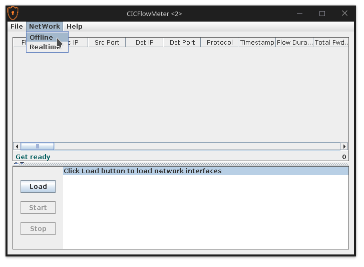
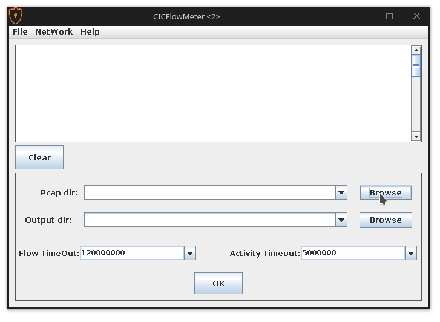

# pcap-flow-splitter

A lightweight C++ tool that takes a capture file (e.g., PCAP or PCAPNG) as input and splits it into several PCAP files,
one for each flow.

## Usage

```shell
$ pcap_flow_splitter -P capture.pcap
$ pcap_flow_splitter -P capture.pcap -O output/ -T 120

$ pcap_flow_splitter --help
Allowed options:
  --help                  produce help message
  -P [ --pcap ] arg       analyze packets from pcap file(s)
  -O [ --output-dir ] arg output directory for pcap files
  -T [ --timeout ] arg    timeout for inactive flows (in seconds)
```

## Build from source

Building from source was tested on:

- Debian 11 x86_64 (5.10 kernel)
- GCC 10.2
- CMake 3.18.4

### Dependencies (system)

To build from source the following libraries must be available to CMake:

- [Boost](https://www.boost.org/) (v1.74 or higher) with components: `filesystem`, `program_options`
- [libpcap](https://github.com/the-tcpdump-group/libpcap)

### Dependencies (bundled)

The following dependencies are bundled into the project as git submodules:

- [mmpr](https://github.com/Schwaggot/mmpr) for reading capture files
- [libtins](https://github.com/mfontanini/libtins) for packet parsing
- [sole](https://github.com/r-lyeh-archived/sole) for trace-source/UUID support

### Build instructions

1. Initialize submodules:

    ```shell
    git submodule update --init --recursive
    ```

2. Run CMake:
    ```shell
    cmake -DCMAKE_BUILD_TYPE=Debug -S . -B cmake-build-debug
    ```

3. Build:
    ```shell
    cmake --build cmake-build-debug --target pcap_flow_splitter -j 4
    ```

## TODO

- Terminate flows on TCP connection close (FIN/ACK)

## Feature extraction

### CICFlowMeter

Download and start CICFlowMeter (requires Java):

```shell
git clone https://github.com/ahlashkari/CICFlowMeter.git
cd CICFlowMeter/
./gradlew execute
```

Select NetWork -> Offline:


Select the folder with split PCAP files as Pcap dir and an arbitrary folder for output:


Click OK, which will generate a csv file for each PCAP file.